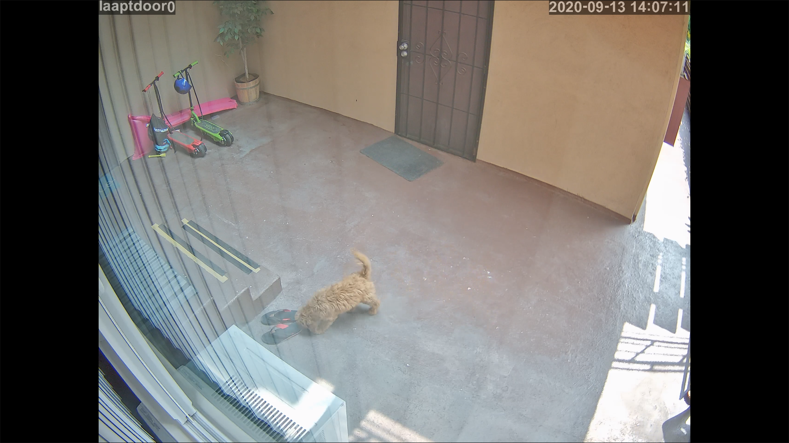

# HTML Live Streaming HLS and ffmpeg

There is nothing novel about this, but it includes some leasons learned while researching all the information.  It also includes links to sources, etc.

If you are streaming from a camera, for HLS, at this time, use h264, as h265/hevc support for playback is very poor in most browsers.

But, it works on mobile, and PC, and can be very close to live (30 seconds or so).



## ffmpeg setup

Setup for ffmpeg is fairly simple.  There are some key factors to minimuze delay, and prevent playback problems.

Service version of the examples are in the systemd folder.

## Reencode

For accessing on the public internet, the stream probably should not saturate the bandwidth of outbound connection.  There will be some delay, but if the files are short that ffmpeg creates, it will aid in scrubing, at the cost of making the manifest larger, and keep delay down within 20 seconds.

The below example is for a raspberry pi.  Specifically pay attention to the **-c:v h264_omx** video codec.  This uses the hardware acceleration of the PI (wont work on say a PC).  In this example, the input stream was the lower quality stream from a security camera, which was 640x480, 4fsp, 512K.

Going out, we want small files, and, we want them to split often.  Spliting for ffmpeg encourages there to be a key frame.  The default keyframe of ffmpeg for h264 is something like 120 frames.  The example below is 2 fps **-r 2**, so we update the key frame interval to be 4 **-x264-params keyint=4** so every 2 seconds **-hls_time 2**, we get a key frame, this allows the split time of 2 seconds to work correctly.. mostly, sometimes it will miss, and have to wait another 2 seconds for the next key frame.

Don't need old files, so that is handled by the flag to delete **-hls_flags delete_segments**.

All the details for hls and other formats can be found at https://ffmpeg.org/ffmpeg-formats.html

```
ffmpeg -i rtsp://<user>:<pass>@<address> -y -s 640x480 -c:v h264_omx -x264-params keyint=4 -b:v 192000 -r 2 -f hls -hls_time 2 -hls_list_size 5 -hls_delete_threshold 100 -hls_flags delete_segments <save location stream.m3u8>
```

On a pi4, this takes about 7% cpu.

## Copy

Security cameras come with 2 rtsp feeds.  For storing off say, 3 days of footage, we can also use ffmpeg to turn the rtsp stream into an hls feed, and at almost no cost to the cpu on a pi4 (2%).  The key to this is to use the copy option **-c copy**, this will cause ffmpeg to demux, then mux into the new .ts format, and create the manifest m3u8 file.  No decoding and encoding, just muxing.

Again, we will keep the segment size down.  The limitation of size will come from the keyframe settings of the source.  In my example, we are key framing every 120 frames at 30fps, so we can split around every 4 seconds.  In this example, hls time is still 5 **-hls_time 5**, but the split time will be 4 or 8 seconds because of the keyframes of the input will only allow splits at this timing.

```
ffmpeg -i rtsp://<user>:<password>@<address> -c copy -f hls -hls_list_size 50000 -hls_time 5 -hls_flags delete_segments -reset_timestamps 1 <location to save stream.m3u8>
```

## Html

So, assuming you are saving into a location accessible by a web server, there is not much to do to get a player working.

HLS is supported by safari, but not chrome or firefox.

The solution is very simple, use hls.js https://hls-js.netlify.app/api-docs/.  See the simple demo here https://hls-js.netlify.app/demo/basic-usage.html.

The only other tricks?  Some CSS to get the video to fit the screen, https://stackoverflow.com/a/36950349.  In the future, need to setup better controls, scrubbing 3 days of footage accuratly can be tough with the default controls.

Get a sample code of both together, at [here](html/player.html).

## More?

Up next, need to add custom controls from the idea of the example from Matt West https://blog.teamtreehouse.com/building-custom-controls-for-html5-videos.  Scrubbing 3 days is too hard with such a small slider.

Its probably possible to combine the 2 streams (though i dont want to accidently go to HD from an external network), and even add a button to switch between the streams.